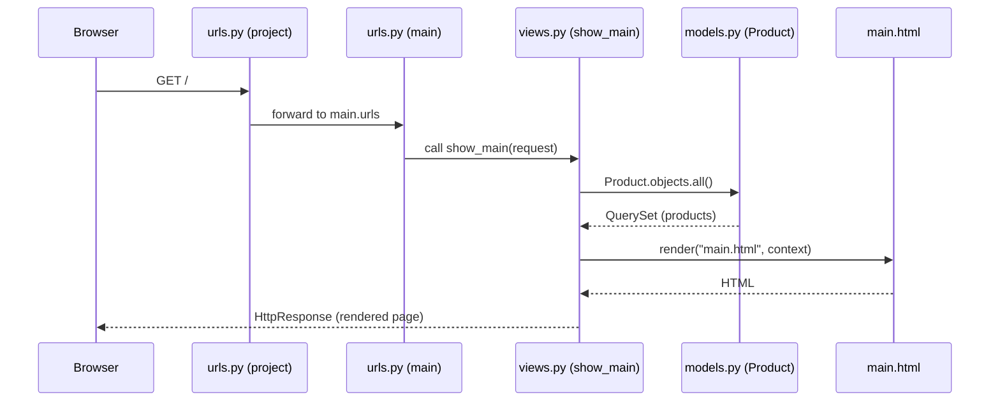
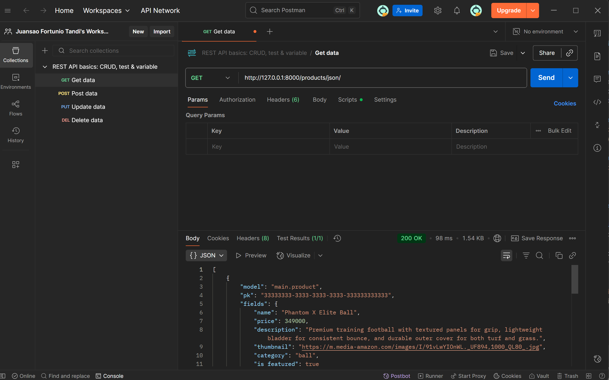
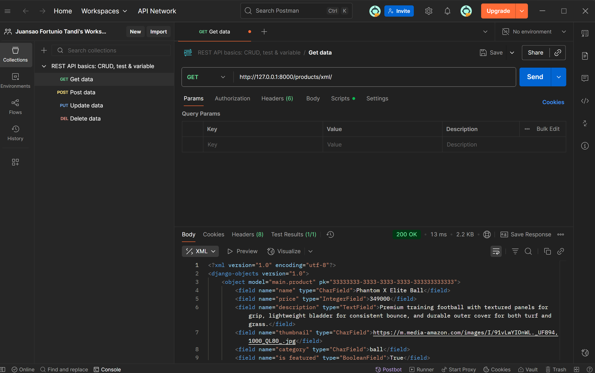
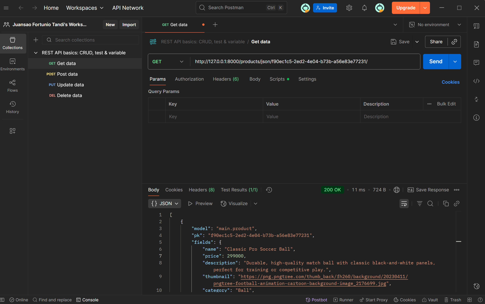
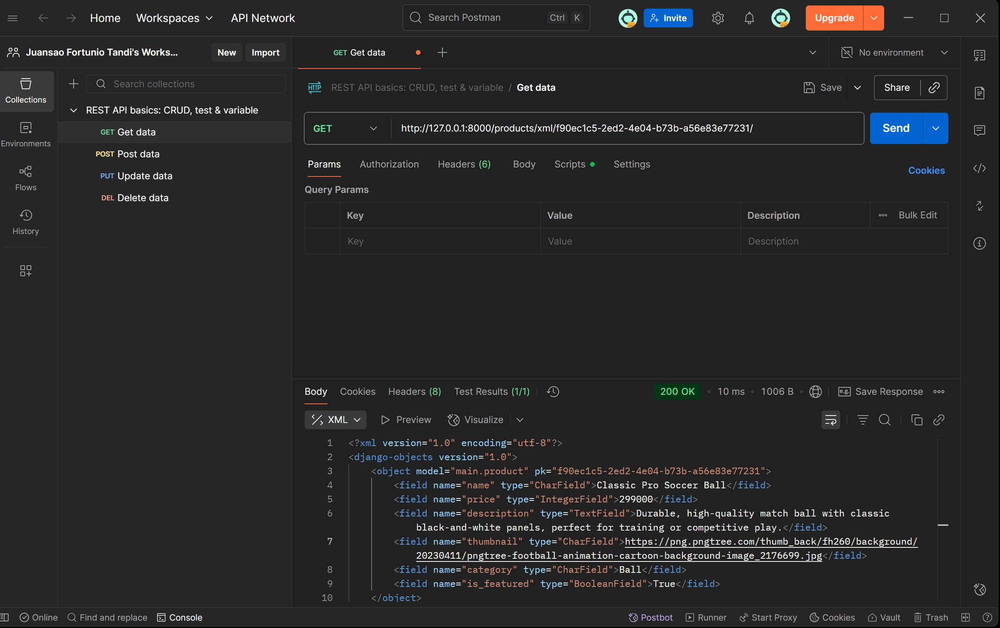

# KickoffKart — Football Shop (Assignment 2)

**Live URL (PWS):** [https://pbp.cs.ui.ac.id/juansao.fortunio/kickoffkart](https://juansao-fortunio-kickoffkart.pbp.cs.ui.ac.id/)

**Identity shown on the site**

* App: **KickoffKart**
* Name: **Juansao Fortunio Tandi**
* Class: **KKI**
* NPM: **2406365345**

---

## 1. Step-by-step implementation of the checklist

I started from scratch, not reusing the Tutorial 1 project:

1. **Project setup**

   * Made a new repo named `kickoffkart`.
   * Set up a Python virtual environment, installed dependencies (`django`, `whitenoise`, `gunicorn`, `psycopg2-binary`, `python-dotenv`, etc.), and created `.env` files to separate local vs production settings.
   * Added a `.gitignore` to ignore venv, `__pycache__`, `db.sqlite3`, `.env`, and collected staticfiles.

2. **New Django project**

   * Ran `django-admin startproject kickoffkart .` so `manage.py` is at the root.
   * Configured `settings.py` to load environment variables and switch between SQLite (local) and PostgreSQL (PWS).

3. **Main app + routing**

   * Created a new app `main` and added it to `INSTALLED_APPS`.
   * In `kickoffkart/urls.py`, included `main.urls`.
   * In `main/urls.py`, mapped the root URL to the `show_main` view.

4. **Model**

   * Implemented a `Product` model with all six required fields (`name`, `price`, `description`, `thumbnail`, `category`, `is_featured`).
   * Ran `makemigrations` and `migrate` to create the database schema.

5. **Views & Templates**

   * Created `show_main` in `views.py` to load all products, pass identity info (app name, my name, class, NPM), and render it using `main.html`.
   * Designed `main.html` using Bootstrap for layout. Added `` so images stored in `main/static/main/` display correctly.

6. **Static images & Fixtures**

   * Placed actual product images (ball and gloves) in `main/static/main/`.
   * Created `two_products.json` fixture containing two sample products, one featured and one not.
   * Loaded data with `python manage.py loaddata two_products`.

7. **Deployment**

   * Added my PWS host to `ALLOWED_HOSTS`.
   * Pushed the repo to PWS.
   * On PWS, ran `collectstatic`, `migrate`, and `loaddata` so the site works with real images.

---

## 2. Request → Response diagram & explanation

**Relationship explanation**

* `urls.py` (project) delegates root requests to `main/urls.py`.
* `main/urls.py` maps `""` to `show_main` in `views.py`.
* `views.py` queries the `Product` model from `models.py`.
* `views.py` passes identity + product data to `main.html`.
* `main.html` is rendered and returned as the final response to the client.

---

## 3. Role of settings.py in a Django project

Central configuration file controlling the whole project.
Defines installed apps, middleware, template engine, static file handling, and database connections.
Stores security settings (`SECRET_KEY`, `DEBUG`, `ALLOWED_HOSTS`).
In this project, it also loads environment variables and configures WhiteNoise for static files in production.

---

## 4. How database migration works in Django

When models are changed, Django compares the new definitions with the current database schema.

* `python manage.py makemigrations` generates migration files (like a step-by-step change log).
* `python manage.py migrate` applies those changes to the database (create tables, add/modify columns, etc.).
  This keeps the database schema synchronized with the Python models over time.

---

## 5. Why Django is chosen as a starting framework

* **Batteries included**: comes with ORM, routing, template engine, static files, and security features out of the box.
* **Clear structure**: MVT pattern encourages separation of concerns.
* **Mature & well-documented**: easy to find tutorials, docs, and community support.
* **Scalable**: good for small class assignments but also used in real production.
* **Focus on concepts**: helps students learn core ideas of web development (models, views, templates, static files, deployment) without needing to install many separate packages.

---

## 6. Any feedback for the teaching assistant

PBP/PBD KKI TAs so far have been really helpful in every tutorial.
I like the idea of separating us into several breakout rooms, each managed by 1 TA.
The weight of the tutorial is also still reasonable to finish within the time limit.
Overall, my feedback is only positive, and I don't have any criticism.

---

# KickoffKart — Assignment 3 (Forms & Data Delivery)

A simple Django MVT app that lists football products, supports adding new products via a form, shows per-item detail pages, and exposes data delivery in **JSON** and **XML**, both for **all objects** and **by ID**.

---

## 1) Why do platforms need data delivery?

* Different clients (web, mobile, services) need machine-readable data.
* Decouples UI from data; enables integration, automation, and testing.
* Avoids scraping HTML; supports caching/versioning and clean contracts.

---

## 2) XML vs JSON & why JSON is more popular

* Both are hierarchical; XML uses tags, JSON uses objects/arrays.
* JSON is less verbose, maps directly to language types, and parses fast in browsers.
* XML has rich standards (XSD/XPath/XSLT) but adds complexity.
* JSON “won” on the web/mobile stack: lightweight, native to JS, ubiquitous in REST.

---

## 3) Purpose of `form.is_valid()` in Django

* Runs field/form validators and cleans inputs into `cleaned_data`.
* Prevents bad/unsafe data from being persisted.
* Surfaces errors back to the template for user correction.

---

## 4) Why `` is required; what if omitted; possible exploits

* Protects against Cross-Site Request Forgery: ensures POST/PUT/DELETE originate from your site.
* Without it, an attacker site can trigger state-changing requests using a logged-in user’s cookies.
* Effects: unintended creates/updates/deletes (e.g., adding products, changing settings).

---

## 5) How I implemented the checklist (step-by-step)

* **URL wiring**: Route root in `kickoffkart/urls.py` to `main.urls`.
* **App URLs**: In `main/urls.py`, add pages (`/`, `/products/add/`, `/products/<uuid:pk>/`) and data endpoints (`/products/json/`, `/products/xml/`, `/products/json/<uuid:pk>/`, `/products/xml/<uuid:pk>/`).
* **Form**: Create `ProductForm` (ModelForm) exposing all fields.
* **Views (pages)**: `add_product` (GET form/POST save → redirect), `product_detail` (fetch by pk).
* **Views (data)**: Use `django.core.serializers` to emit JSON/XML for list and by-ID.
* **Templates**: `main.html` shows list + “Add” + per-item “Detail`; `product\_form.html`; `product\_detail.html\`.
* **Thumbnails**: Use full `https://` image URLs (URLField). Fixed existing items via Admin/Shell.
* **Verification**: `curl` the 4 endpoints; click through Add/Detail; confirm by-ID works with UUIDs.
* **Deploy & docs**: Push, test on prod, capture Postman screenshots for JSON/XML list and by-ID.

---

## 6) Do you have any feedback for the teaching assistants for Tutorial 2?

The teaching assistant was helpful by providing a zoom meeting and breakout room for us to ask questions.
I hope next time, there won't be any error in the tutorial file that just got revised during our tutorial session, so it is more convenient for everyone, including the TAs.

---

## 7) Postman Results

**All products (JSON)**

**All products (XML)**

**Single product by ID (JSON)**

**Single product by ID (XML)**

---

## KickoffKart — Assignment 4 (Authentication, Sessions & Ownership)

### 1) What is Django’s `AuthenticationForm`? Advantages & disadvantages
`AuthenticationForm` (from `django.contrib.auth.forms`) is a built-in form for logging in existing users. It validates a username and password against Django’s authentication backends and surfaces appropriate errors (e.g., “invalid credentials”, “inactive account”).

**Advantages**
- **Secure & battle-tested:** Uses Django’s auth system (password hashing, backend checks).
- **Fast to integrate:** Ready-to-use; pairs naturally with `login()` and `AuthenticationMiddleware`.
- **Good error handling & i18n:** Standardized messages and translation support.

**Disadvantages**
- **Username-centric by default:** Email/phone logins need customization or a custom form.
- **Styling is minimal:** You must add your own HTML/CSS (or crispy-forms) for UX.
- **No rate limiting / captcha built-in:** You must add throttling or captcha yourself.

---

### 2) Authentication vs authorization; how Django implements them
- **Authentication** answers *“Who are you?”*  
  Django authenticates via **authentication backends** and the **session**. On success, `login(request, user)` persists the user’s ID in the session; `request.user` becomes a `User` (or `AnonymousUser`).
- **Authorization** answers *“What are you allowed to do?”*  
  Django provides **permissions** and **groups**, decorators like `@login_required` and `@permission_required`, and per-view/per-object checks in code (e.g., verifying ownership before acting).

In practice: we authenticate with `AuthenticationForm` + `login()`, then authorize with `@login_required` on views and (optionally) permission/ownership checks.

---

### 3) Sessions vs cookies for storing web app state — benefits & drawbacks
- **Sessions (server-side, keyed by a cookie `sessionid`):**  
  **Benefits:** Sensitive data isn’t stored on the client; larger payloads; easy invalidation/rotation.  
  **Drawbacks:** Requires a server/session store (DB/Cache); adds read/write overhead; needs shared store in multi-server deployments.
- **Cookies (client-side):**  
  **Benefits:** Simple, stateless on the server; great for small, non-sensitive flags (e.g., UI preferences).  
  **Drawbacks:** Size limits; visible to the client; vulnerable to tampering/theft without signing and proper flags; not suited for secrets.

In this assignment we used a **cookie** (`last_login`) only for a harmless display value, while real auth state lives in the **session**.

---

### 4) Are cookies secure by default? Risks & how Django mitigates them
Cookies aren’t secure by default. Risks include **theft via XSS**, **CSRF**, and **tampering**.

**Django mitigations**
- **CSRF protection**: verified token for state-changing requests.
- **Cookie flags**: `HttpOnly` (hide from JS), `Secure` (HTTPS only), `SameSite` (CSRF reduction).  
  Configurable via `SESSION_COOKIE_SECURE`, `CSRF_COOKIE_SECURE`, `SESSION_COOKIE_SAMESITE`, `CSRF_COOKIE_SAMESITE`.
- **Signing**: Session cookies are signed; `django.core.signing` supports signed cookies for custom data.
- **Session rotation**: Best practice to rotate session on privilege changes.

Bottom line: use **sessions** for sensitive server state; if you must use cookies, sign/encrypt and set strict flags.

---

### 5) How I implemented the checklist (step-by-step)
- **Settings (Phase 0):** Verified `INSTALLED_APPS`/`MIDDLEWARE` include auth, sessions, messages; set `LOGIN_URL`, `LOGIN_REDIRECT_URL`, `LOGOUT_REDIRECT_URL`.  
- **Auth pages (Phase 1):** Added URLs `/register`, `/login`, `/logout`; implemented `register` (`UserCreationForm`), `login_user` (`AuthenticationForm` + `login()`), `logout_user` (`logout()`); created `login.html` and `register.html`; navbar toggles links based on `user.is_authenticated`.  
- **Cookie display (Phase 2):** After successful login, set a `last_login` cookie (`httponly`, `samesite='Lax'`) and showed it on the main page; deleted it on logout.  
- **Access control (Phase 3):** Applied `@login_required` to `show_main`, `add_product`, and `product_detail`; supported `?next=` so users return to their intended page post-login.  
- **Ownership link (Phase 4):** Added `user = ForeignKey(User, ...)` to `Product`; in `add_product`, saved `request.user` as owner; filtered `show_main` with `Product.objects.filter(user=request.user)` so each user sees only their items.  
- **Data seeding (Phase 5):** Created two accounts (Andi and Budi) and seeded 3 products each with HTTPS thumbnails; verified isolation by logging in as each user.  
- **Deploy (Phase 6):** Merged branch to `master`, pushed to PWS, ran `migrate`; confirmed auth flow, cookie display, and ownership filtering match localhost.
